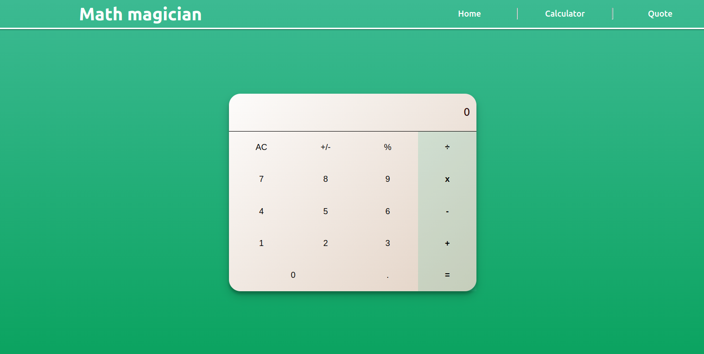

# Math Magicians: Full Website
This is the first project of the Math Magicians application. i have set up the environment and tools needed to develop a React application. 
I have created a full website for the Math magicians app, consisting of several pages and using the components you already created.

## Built With 

- React Js
- Vs code

## Project Photo

## Deployment Links

- [eric-calculator](https://eric-calculator.herokuapp.com/)
- [calculator-eric](https://calculator-eric.netlify.app/Calculator)

## Getting Started
To get a local copy of this exercice, Please follow these simple example steps.

1. Clone this repository or download the Zip folder:

**``git@github.com:TuyishimireEric/JavaScript-group-capstone.git``**

2. Navigate to the location of the folder in your machine:

**``you@your-Pc-name:~$ cd <folder>``**

3. Press Enter to navigate to your local clone.

Now you can go and play with it as you wish :smile:

## Authors

👤 Eric TuyishimireEric

- GitHub: [@TuyishimireEric](https://github.com/TuyishimireEric)
- LinkedIn: [@TuyishimireEric](https://www.linkedin.com/in/Tuyishimire-Eric-32426b21a/)
- E-mail: [tuyishimireericc@gmail.com](tuyishimireericc@gmail.com)

## Show your support
Give a ⭐️ if you like this project!

## 🤝 Contributing

Contributions, issues, and feature requests are welcome!

Feel free to check the [issues page](https://github.com/TuyishimireEric/math_magician/issues).

## Acknowledgments

- Hat tip to anyone whose code was used
- Big thanks to the [Microverse](https://bit.ly/MicroverseTN) community with a special mention of my coding partners, morning session teams, standup teams and reviewers.

## 📝 License
This project is [MIT](./LICENSE.txt) licensed.
